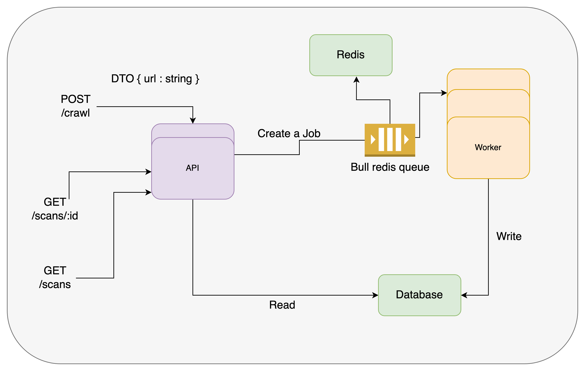

# Web Crawler Application

This is a web crawler application consisting of 
two components: an API and a worker. 
The API provides endpoints to add url for scanning and send to 
the worker for processes URL scans asynchronously.

## API

The API component handles incoming requests and manages the crawling process.

### Prerequisites

- Node.js (version v18.12.0)
- yarn (version 1.22.19)

### Configuration

Create .env file on root directory for secrets for docker compose

```
POSTGRES_DB=postgres
POSTGRES_PASSWORD=xxxx
POSTGRES_USER=postgres
QUEUE_NAME=crawler-request
```

## Boostrap

Install packages

```yarn install```

start boostrap script for quick start 

```yarn run boostrap```


## Swagger Documentation  
```http://localhost:3000/docs```


## Example

```
curl --location 'localhost:3000/crawl' \
--header 'Content-Type: application/json' \
--data '{
    "url" : "https://www.google.com/"
}'
```

Get scan results by id ( wait few seconds for finish processing )
```
curl --location 'localhost:3000/scans/${your scan id}'
```

Get all scans results
```
curl --location 'localhost:3000/scans/
```

## Architecture 



I have decided to implement a consumer-producer design pattern that is designed to handle scalability and separation between the information retrieval process and the actual scanning process.

By using this pattern, we can easily scale up the workers that consume from a shared queue, utilizing the Bull library with redis (https://www.npmjs.com/package/@nestjs/bull).

The API is implemented as an asynchronous API because fetching data may take some time. Meanwhile, we can continue to send more jobs without waiting for the retrieval process to complete.


